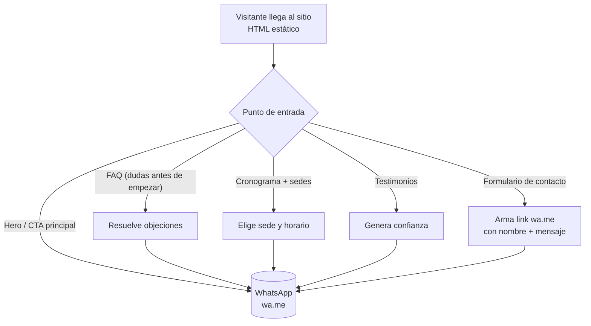

# Ichinen Dojo — Aikido Argentina

Landing page de la escuela de Aikido **Ichinen Dojo**, con dos sedes en CABA (Agronomía y Villa Pueyrredón).

## 🎯 Objetivo del proyecto

Conseguir que la persona que visita el sitio **pruebe una clase gratis**, contactando al dojo por **WhatsApp**. No hay venta online, no hay backend, no hay base de datos: es una landing de captación simple y rápida.

El sitio explica qué es el Aikido (filosofía Ai/Ki/Do), resuelve las dudas típicas de un principiante (FAQ), muestra el cronograma de clases de ambas sedes con sus instructores, y suma testimonios de alumnos para generar confianza. Todo camino termina en el mismo lugar: un botón que abre WhatsApp con un mensaje pre-armado.

> Detalle de negocio en [`ai/analysis.md`](ai/analysis.md), reglas en [`ai/rules.md`](ai/rules.md) y contenido en [`ai/taxonomy.md`](ai/taxonomy.md).

## 🔄 Diagrama de flujo



**Cómo leerlo:** no importa por dónde entre el visitante (hero, FAQ, cronograma, testimonios o el formulario del footer) — todos los caminos convergen en **WhatsApp**. No hay servidor propio ni base de datos: el sitio no persiste nada del visitante.

## 🧱 Arquitectura

| Capa | Implementación |
|---|---|
| Presentación | HTML estático + CSS (sin framework, sin build) |
| Interactividad | `js/main.js` vanilla: acordeón FAQ, carrusel, menú mobile |
| Conversión | Links `wa.me` (WhatsApp), sanitizados client-side |
| Datos | No existen — no hay backend ni base de datos |
| Hosting | DonWeb (Apache): archivos en `public_html/` + `.htaccess` |

> Arquitectura completa en [`ai/architecture.md`](ai/architecture.md).

## 🗂️ Estructura

```text
index.html         Página única con las 10 secciones (hero, FAQ, beneficios, filosofía,
                    cronograma, sedes, testimonios, contacto)
css/style.css       Estilos: paleta negro/blanco/rojo-naranja, mobile-first
js/main.js          Acordeón, carrusel, menú mobile, conversión a WhatsApp
assets/img/         Fotos de acción, logo del dojo, fotos de instructores/alumnos
ai/                 Documentación: protocolo, análisis, arquitectura, taxonomía,
                    reglas, guardrails, checks, auditoría de seguridad, deploy
```

## 🚀 Correr en local

Sitio 100% estático, sin dependencias:

```bash
python3 -m http.server
```

o directamente abrir `index.html` en el navegador.

## 🤖 Para Claude Code

Antes de cualquier tarea, seguir el protocolo de [`CLAUDE.md`](CLAUDE.md): `ai/templates/execution.md` → `ai/context-loader.md` → `ai/analysis.md`.
